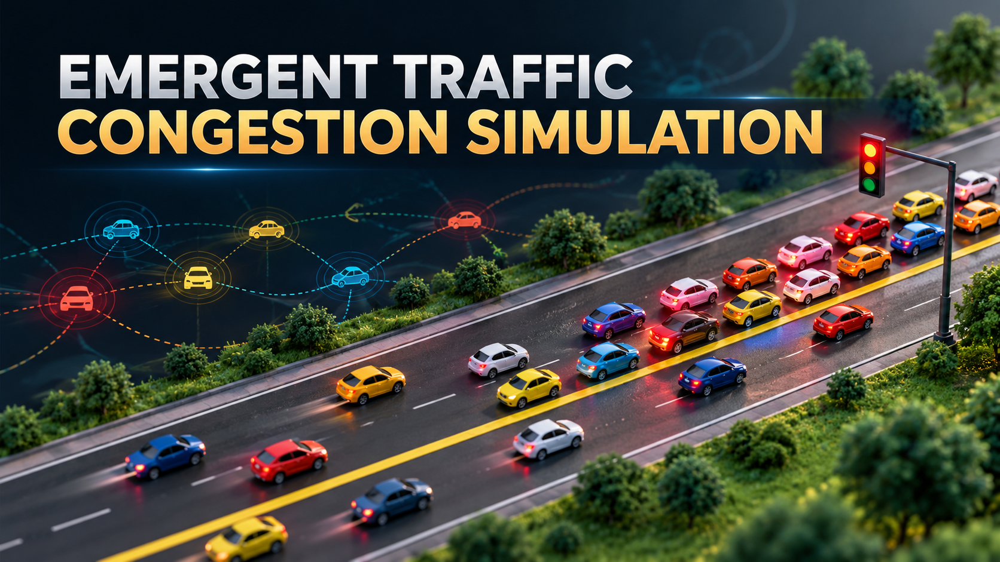

# 🚦 Emergent Traffic Congestion Simulation


> **Complex Systems – NetLogo Assignment**


A NetLogo-based simulation that demonstrates how **traffic congestion can emerge from simple interactions between individual vehicles, nearby vehicles, and a traffic light**.

---

## 🎥 Video Presentation

The project presentation video is available through the following Google Drive folder:

👉 **[Watch the Video Presentation](https://drive.google.com/drive/folders/1eW7fzW5E2Q48mRSUCNbGdPaM_4S7LCQt?usp=sharing)**

The video demonstrates the project concept, NetLogo model, agent behaviour, traffic-light interaction, emergent congestion, and simulation results.

---

## 📌 Project Overview

The **Emergent Traffic Congestion Simulation** models vehicle movement on a two-lane road using an agent-based approach.

Each vehicle follows simple behavioural rules such as:

- 🚗 Moving forward along the road
- 📏 Maintaining a safe distance from the vehicle ahead
- 🐢 Reducing speed when another vehicle is too close
- 🛑 Stopping when necessary
- 🚦 Responding to traffic-light states
- ⚡ Gradually accelerating and decelerating

Although each vehicle follows relatively simple local rules, interactions between many vehicles can produce complex system-level behaviour such as **traffic queues and congestion**.

This demonstrates a key concept of Complex Systems: **emergence**.

---

## 🎯 Objectives

The main objectives of this project are to:

- 🧩 Demonstrate a Complex System using NetLogo
- 🚗 Simulate individual vehicle behaviour
- 🚦 Model traffic-light-controlled traffic
- 🔄 Demonstrate local interactions between agents
- 📈 Measure traffic conditions using simulation statistics
- 🌐 Observe how global traffic patterns emerge from local rules
- 🔬 Explore concepts such as emergence, feedback, and self-organization

---

## 🧠 Complex Systems Concepts

The simulation demonstrates several important Complex Systems concepts.

### 🤖 Agents

The model contains two main agent types:

- **Cars** – individual vehicles travelling on the road
- **Traffic Light** – controls the movement of vehicles

Each car has its own speed and maximum-speed characteristics.

### 🔗 Local Interactions

Cars primarily react to their local environment.

A vehicle observes the vehicle ahead in the same lane and changes its speed according to the distance between them.

### 🔄 Feedback

A change in one vehicle can affect other vehicles.

For example:

`One car slows down → Following car slows down → More cars slow down → Queue develops`

This creates a chain of interactions throughout the system.

### 🌱 Emergence

Traffic congestion is not directly created by a single rule.

Instead, congestion emerges from the combined behaviour of many vehicles interacting with each other and responding to the traffic light.

### 🔁 Self-Organization

Vehicles naturally form queues when they encounter a red traffic light or slower vehicles, without a central controller explicitly creating the queue.

---

## 🛣️ Simulation Environment

The model represents a **two-lane road**.

| Element | Description |
|---|---|
| 🟩 Green area | Surrounding environment |
| ⬜ Gray area | Road |
| 🟨 Yellow line | Separates the two lanes |
| 🚗 Cars | Individual vehicle agents |
| 🚦 Traffic light | Controls vehicle movement |

Vehicles travel along the road from left to right.

---

## 🚦 Traffic Light Behaviour

The traffic light operates through three states:

```text
🟢 GREEN
   ↓
🟡 YELLOW
   ↓
🔴 RED
   ↓
🟢 GREEN
```

### 🟢 Green

Vehicles are allowed to continue moving.

### 🟡 Yellow

Vehicles approaching the traffic-light area reduce their speed.

### 🔴 Red

Vehicles approaching the traffic light stop and wait.

When several vehicles arrive during the red phase, a queue forms. When the light changes to green, vehicles begin moving again.

---

## 🚗 Vehicle Behaviour

Each vehicle has:

- Current speed
- Maximum speed

During every simulation step, vehicles evaluate the traffic around them.

### Vehicle-following behaviour

A vehicle checks for another vehicle ahead in the same lane.

Depending on the distance:

- 🛑 Very close → stop
- 🐢 Moderately close → reduce speed
- 🚗 Sufficient distance → continue or accelerate

The model also uses gradual acceleration and deceleration to produce smoother vehicle movement.

---

## 🎛️ Simulation Controls

The interface provides several parameters for experimenting with different traffic conditions.

| Parameter | Purpose |
|---|---|
| 🚗 **Number of Cars** | Controls the number of vehicles in the simulation |
| ⚡ **Max Speed** | Defines the maximum speed of vehicles |
| 📏 **Safe Distance** | Controls the desired minimum distance between vehicles |
| 🚦 **Light Duration** | Controls the duration of traffic-light states |

Changing these parameters allows different traffic scenarios to be tested.

---

## 📊 Simulation Measurements

The model calculates several statistics during execution.

### 🏎️ Average Speed

Shows the average speed of vehicles currently in the simulation.

### 🛑 Stopped Cars

Shows the number of vehicles that are stopped or moving at a very low speed.

### 🚙 Traffic Density

Represents the number of vehicles relative to the available road capacity.

### 🚧 Congestion %

Shows the percentage of vehicles experiencing significantly reduced speed.

### 🚦 Traffic Light

Displays the current traffic-light state:

- Green
- Yellow
- Red

### 🚘 Queue Length

Shows the number of vehicles waiting in the traffic-light queue.

### 🏁 Cars Passed

Counts the number of vehicles that successfully complete their movement across the simulated road.

---

## ▶️ How to Run the Simulation

### 1. Open NetLogo

Open the `.nlogo` project file using NetLogo.

### 2. Configure Parameters

Adjust:

- Number of cars
- Maximum speed
- Safe distance
- Light duration

### 3. Initialize the Model

Click:

```text
SETUP
```

This creates the road, vehicles, traffic light, and initial simulation state.

### 4. Start the Simulation

Click:

```text
GO
```

### 5. Observe the System

Observe:

- Vehicle movement
- Vehicle interactions
- Traffic-light changes
- Queue formation
- Congestion
- Simulation statistics

---

## 🔬 Example Emergent Behaviour

A typical congestion pattern can develop as follows:

```text
🔴 Red Traffic Light
        ↓
🚗 Vehicles Stop
        ↓
🚘 More Vehicles Arrive
        ↓
🚙 Queue Becomes Longer
        ↓
📈 Stopped Cars Increase
        ↓
📈 Congestion Increases
        ↓
🟢 Traffic Light Turns Green
        ↓
🚗 Vehicles Start Moving
        ↓
📉 Queue Gradually Decreases
```

The important point is that the queue is **not manually created**. It emerges from the interaction between individual vehicles and the traffic-light rules.

---

## 🧪 Experimentation

The model can be used to investigate questions such as:

- What happens when the number of cars increases?
- How does maximum speed affect congestion?
- What happens when the safe distance is increased?
- How does traffic-light duration affect queue length?
- How does vehicle density affect average speed?
- How do local vehicle interactions produce global congestion?

These experiments demonstrate how changing individual-level parameters can influence system-level behaviour.

---

## 🏗️ Model Structure

The NetLogo model contains:

```text
Emergent Traffic Congestion Simulation
│
├── 🚗 Cars
│   ├── Speed
│   └── Maximum Speed
│
├── 🚦 Traffic Light
│   ├── Green
│   ├── Yellow
│   └── Red
│
├── 🛣️ Road Environment
│   ├── Two lanes
│   └── Lane divider
│
└── 📊 Measurements
    ├── Average Speed
    ├── Stopped Cars
    ├── Traffic Density
    ├── Congestion %
    ├── Queue Length
    └── Cars Passed
```


---

## 📁 Project Files

The repository contains the main NetLogo simulation source file.

Recommended project structure:

```text
📦 Emergent-Traffic-Congestion-Simulation
│
├── 📄 README.md
├── 💻 Emergent-Traffic-Congestion-Simulation.nlogo
└── 📂 assets/
    └── 🖼️ screenshots
```

---

## 🛠️ Technologies

| Technology | Purpose |
|---|---|
| 🦁 **NetLogo** | Agent-based simulation |
| 💻 **NetLogo Language** | Simulation logic and agent behaviour |
| 📊 **NetLogo Interface** | Parameters, controls, and measurements |

---

## 🌟 Key Takeaway

> **Complex behaviour can emerge from simple interactions between individual agents.**

This project demonstrates how individual vehicles following simple behavioural rules can collectively produce traffic queues, reduced speeds, and congestion.

The simulation provides a practical example of **agent-based modelling and emergence in Complex Systems**.

---

## 👥 Team Members

| Member | Student ID | Contribution |
|---|---|---|
| Member 01 | Add Student ID | Add contribution |
| Member 02 | Add Student ID | Add contribution |
| Member 03 | Add Student ID | Add contribution |
| Member 04 | Add Student ID | Add contribution |

> ⚠️ **Note:** The assignment brief mentioned a maximum of 3 members. If your lecturer has approved a 4-member team, update the table above with the confirmed member details.

---

## 🎓 Academic Project

**Module:** Complex Systems  
**Platform:** NetLogo  
**Project Type:** Agent-Based Simulation  
**Project Theme:** Emergent Traffic Congestion

---

<p align="center">
  🚦 <strong>Emergent Traffic Congestion Simulation</strong> 🚦
  <br>
  <sub>Exploring emergence through agent-based modelling with NetLogo.</sub>
</p>
